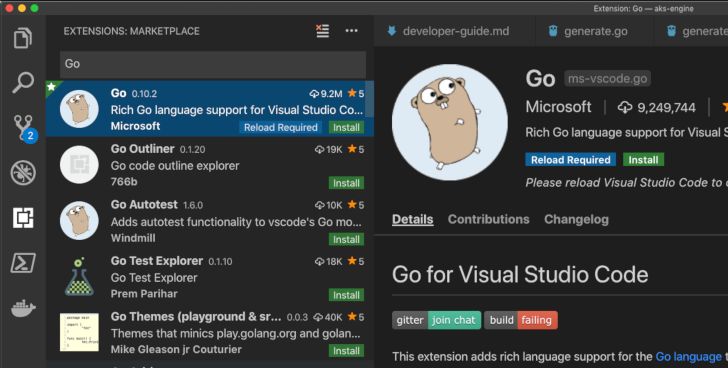
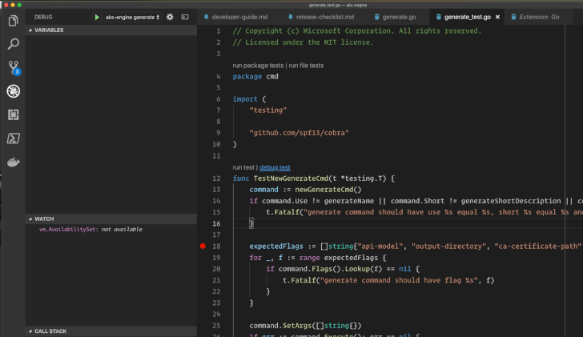
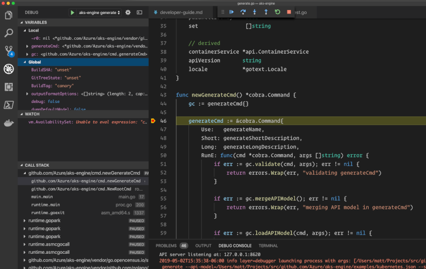

# Developer Guide

This guide explains how to set up your environment for development on AKS Engine.

## Prerequisites

- [`git`](https://git-scm.com/)
- [`go`](https://golang.org/dl) 1.14.2 or later
- [`dep`](https://github.com/golang/dep) 0.5.1 or later
- An [Azure](https://azure.microsoft.com/en-us/) subscription
- [`kubectl`](https://kubernetes.io/docs/tasks/tools/install-kubectl/)

## Contribution Guidelines

We welcome contributions. This project has set up some guidelines in
order to ensure that (a) code quality remains high, (b) the project
remains consistent, and (c) contributions follow the open source legal
requirements. Our intent is not to burden contributors, but to build
elegant and high-quality open source code so that our users will benefit.

Make sure you have read and understood the main CONTRIBUTING guide:

https://github.com/Azure/aks-engine/blob/master/CONTRIBUTING.md

## Build AKS Engine from Source

### Docker Development Environment

The easiest way to start hacking on AKS Engine is to use a Docker-based environment. If you already have Docker installed then you can get started with a few commands.

```console
$ make dev
```

Or on Windows (ensure Docker is configured for Linux containers on Windows):

```console
powershell ./makedev.ps1
```

This make target mounts the AKS Engine source directory as a volume into the Docker container, which means you can edit your source code in your favorite editor on your machine, while still being able to compile and test inside of the Docker container. This environment mirrors the environment used in the AKS Engine continuous integration (CI) system.

When `make dev` completes, you will be left at a command prompt inside a Docker container.

Run the following commands to pull the latest dependencies and build the `aks-engine` tool.

```sh
# set up the hack/tools directory for your platform
make -C hack/tools clean install
# install and download build dependencies
make bootstrap
# build the `aks-engine` binary
make build
```

The build process leaves the compiled `aks-engine` binary in the `bin` directory. Make sure everything completed successfully by running `bin/aks-engine` without any arguments:

```sh
$ ./bin/aks-engine
Usage:
  aks-engine [flags]
  aks-engine [command]

Available Commands:
  addpool       Add a node pool to an existing AKS Engine-created Kubernetes cluster
  completion    Generates bash completion scripts
  deploy        Deploy an Azure Resource Manager template
  generate      Generate an Azure Resource Manager template
  get-logs      Collect logs and current cluster nodes configuration.
  get-versions  Display info about supported Kubernetes versions
  help          Help about any command
  rotate-certs  Rotate certificates on an existing AKS Engine-created Kubernetes cluster
  scale         Scale an existing AKS Engine-created Kubernetes cluster
  upgrade       Upgrade an existing AKS Engine-created Kubernetes cluster
  version       Print the version of aks-engine

Flags:
      --debug                enable verbose debug logs
  -h, --help                 help for aks-engine
      --show-default-model   Dump the default API model to stdout

Use "aks-engine [command] --help" for more information about a command.
```

[Here's a quick demo video showing the dev/build/test cycle with this setup.](https://www.youtube.com/watch?v=lc6UZmqxQMs)

### Building on Windows, OSX, and Linux

If the above docker container conveniences don't work for your developer environment, below is per-platform guidance to help you set up your local dev environment manually to build an `aks-engine` binary from source.

Building an `aks-engine` binary from source has a few requirements for each of the platforms. Download and install the prerequisites for your platform: Windows, Linux, or Mac:

#### Windows

Setup steps:

- Setup your go workspace. This guide assumes you are using `c:\Users\me\code\go` as your Go workspace:
  1. Type WIN+R to open the run prompt
  1. Type `rundll32 sysdm.cpl,EditEnvironmentVariables` to open the system variables
  1. Add `c:\go\bin` and `c:\Users\me\code\go\bin` to your PATH variables
  1. Click "new" and add new environment variable named `GOPATH` and set the value to `c:\Users\me\code\go`

- Build aks-engine:
  1. Type Windows key-R to open the run prompt
  1. Type `cmd` to open a command prompt
  1. Type `mkdir %GOPATH%` to create your gopath
  1. Type `cd %GOPATH%`
  1. Type `mkdir -p src\github.com\Azure` to create the gopath to aks-engine
  1. Type `cd src\github.com\Azure`
  1. Type `git clone https://github.com/Azure/aks-engine` to download aks-engine from GitHub
  1. Type `cd aks-engine`
  1. Type `make bootstrap` to get the supporting components
  1. Type `make` to build the project
  1. Run `.\bin\aks-engine.exe` to see the command line parameters

#### OS X and Linux

Setup steps:

  1. Open a command prompt to setup your gopath:
  1. `mkdir $HOME/go`
  1. Edit `$HOME/.bash_profile` and add the following lines to setup your go path:
      ```sh
      export GOPATH=$HOME/go
      export PATH=$PATH:/usr/local/go/bin:$GOPATH/bin
      ```
  1. `source $HOME/.bash_profile`

Build aks-engine:

  1. Type `mkdir -p $HOME/go/src/github.com/Azure` to create your gopath
  1. Type `cd $_` to switch directories to that same path
  1. Type `git clone https://github.com/Azure/aks-engine` to download aks-engine from GitHub
  1. Type `cd aks-engine` to change to the source directory
  1. Type `make bootstrap` to install supporting components
  1. Type `make` to build the project
  1. Type `./bin/aks-engine` to see the command line parameters

### Structure of the Code

The code for the AKS Engine project is organized as follows:

- The individual programs are located in `cmd/`. Code inside of `cmd/`
  is not designed for library re-use.
- Shared libraries are stored in `pkg/`.
- The `tests/` directory contains a number of utility scripts. Most of these
  are used by the CI/CD pipeline.
- The `docs/` folder is used for documentation and examples.

Go dependencies are managed with
[Golang Dep](https://github.com/golang/dep) and stored in the
`vendor/` directory.

### Git Conventions

We use Git for our version control system. The `master` branch is the
home of the current development candidate. Releases are tagged.

We accept changes to the code via GitHub Pull Requests (PRs). One
workflow for doing this is as follows:

1. Use `go get` to clone the aks-engine repository: `go get github.com/Azure/aks-engine`
2. Fork that repository into your GitHub account
3. Add your repository as a remote for `$GOPATH/github.com/Azure/aks-engine`
4. Create a new working branch (`git checkout -b feat/my-feature`) and
   do your work on that branch.
5. When you are ready for us to review, push your branch to GitHub, and
   then open a new pull request with us.

### Third Party Dependencies

Third party dependencies reside locally inside the repository under the `vendor/` directory. We use [dep](https://github.com/golang/dep) to enforce our dependency graph, declared in [Gopkg.toml](https://github.com/Azure/aks-engine/blob/master/CONTRIBUTING.md) in the project root.

If you wish to introduce a new third party dependency into `aks-engine`, please file an [issue](https://github.com/Azure/aks-engine/issues), and include the canonical VCS path (e.g., `github.com/Azure/azure-sdk-for-go`) along with either the desired release string expression to depend on (e.g., `~8.1.0`), or the commit hash to pin to a static commit (e.g., `4cdb38c072b86bf795d2c81de50784d9fdd6eb77`). A project maintainer will then own the effort to update the codebase with that dependency, including relevant updates to `Gopkg.toml` and `vendor/`.

As a rule we want to distinguish dependency update PRs from feature/bug PRs; we may ask that feature/bug PRs which include updates to `vendor/` and/or contain any other dependency-related overhead to be triaged into separate PRs that can be managed independently, pre-requisite dependency changes in one, and features/bugs in another. The objective of enforcing these distinctions is to help focus the PR review process, and to make manageable the difficult task of rationalizing a multitude of parallel PRs in flight, many of which which may carry hard-to-reconcile dependency side-effects when aggressively updated with a fresh dependency graph as part of the PR payload.

### Go Conventions

We follow the Go coding style standards very closely. Typically, running
`go fmt` will make your code beautiful for you.

We also typically follow the conventions recommended by `go lint` and
`gometalinter`. Run `make test-style` to test the style conformance.

Read more:

- Effective Go [introduces formatting](https://golang.org/doc/effective_go.html#formatting).
- The Go Wiki has a great article on [formatting](https://github.com/golang/go/wiki/CodeReviewComments).

### Unit Tests

Unit tests may be run locally via `make test`.

### End-to-end Tests

AKS Engine maintains its own E2E test implementation (see the `test/e2e/` source directory) to validate Kubernetes on Azure functionality from AKS Engine source.

A `make` target convenience is maintained to easily run these tests:

```sh
$ make test-kubernetes
```

In practice, running E2E tests locally requires lots of environmental context, in order to tell the E2E runner what kind of cluster configuration you want to test, which tests you may want to run or skip, what level of timeout tolerance to permit, and many other runtime-configurable options that express the exact test criteria you intend to validate. A real-world E2E invocation may look this this instead:

```sh
$ ORCHESTRATOR_RELEASE=1.18 CLUSTER_DEFINITION=examples/kubernetes.json SUBSCRIPTION_ID=$TEST_AZURE_SUB_ID CLIENT_ID=$TEST_AZURE_SP_ID CLIENT_SECRET=$TEST_AZURE_SP_PW TENANT_ID=$TEST_AZURE_TENANT_ID LOCATION=$TEST_AZURE_REGION CLEANUP_ON_EXIT=false make test-kubernetes
```

Thorough guidance around effectively running E2E tests to validate source code changes can be found [here](running-tests.md).

### Debugging

To debug AKS Engine code directly, use the [Go extension](https://marketplace.visualstudio.com/items?itemName=ms-vscode.Go)
for Visual Studio Code or use [Delve](https://github.com/go-delve/delve) at the command line.

#### Visual Studio Code

To debug AKS Engine with [VS Code](https://code.visualstudio.com/), first ensure that you have the
[Go extension](https://marketplace.visualstudio.com/items?itemName=ms-vscode.Go) installed. Click
the "Extensions" icon in the Activity Bar (on the far left), search for "go", then install the
official Microsoft extension titled "Rich Go language support for Visual Studio Code."



Once installed, the Go extension will `go get` several helper applications, including Delve for
debugging support. You can read more about VS Code integration with Delve
[here](https://github.com/Microsoft/vscode-go/wiki/Debugging-Go-code-using-VS-Code).

Open the directory that you checked out the `aks-engine` repo to in VS Code.

##### Debugging Tests

If you are writing tests (and if you are, we want to give you a hug!), you can debug them directly
in Visual Studio code.

Set a breakpoint inside a test, then move your mouse pointer to the top of the function definition.
To the right of "run test" appears a link saying "debug test": click it!



##### Debugging AKS Engine

To debug changes to AKS Engine source during active development, the default Go debugging configuration in `.vscode/launch.json` needs
to be edited. Open that file (or just click the gear-shaped "Open launch.json" icon if you have the
Debug panel open).

Here is an example `launch.json` file that contains a configuration for debugging the
`aks-engine generate` command using the `examples/kubernetes.json` file for its cluster
configuration.

```json
{
  "version": "0.2.0",
  "configurations": [
    {
      "name": "aks-engine generate",
      "type": "go",
      "request": "launch",
      "mode": "debug",
      "program": "${workspaceRoot}",
      "env": {},
      "args": [
        "generate", "--api-model=${workspaceRoot}/examples/kubernetes.json",
        "--set", "masterProfile.dnsPrefix=my-dns-prefix",
        "--set", "linuxProfile.ssh.publicKeys[0].keyData=my-public-key-contents",
        "--set", "servicePrincipalProfile.clientId=my-service-principal-client-id",
        "--set", "servicePrincipalProfile.secret=my-service-principal-secret"
      ],
      "showLog": true
    }
  ]
}
```

Copy and paste the configuration and change the values in the `--set` arguments to reference your
details. You can create multiple configurations in `launch.json` to debug `aks-engine upgrade`,
`scale`, and other commands.

For a more detailed debugging configuration, check out the [example launch.json](example-launch.json)
in this directory. It assumes you have `$CLIENT_ID`, `$CLIENT_SECRET`, and `$AKSE_PUB_KEY` environment
variables set, and will prompt you for other command inputs when starting the debugger.

The `.vscode/launch.json` file is ignored by `git`, so your local version won't be overwritten when
you push or pull changes.

To start debugging, set a breakpoint in the code of interest. Then choose your configuration in the
Debug panel and click the green "Start Debugging" arrow.



###### Next Steps for Debugging

When the debugger hits your breakpoint, the variables and call stack will populate in the Debug
panel. Now you can step through code and inspect memory at runtime using Visual Studio Code's
standard debugging controls.

This just scratches the surface. Please
[read more about debugging](https://code.visualstudio.com/docs/editor/debugging) with VS Code.

#### CLI

To debug `aks-engine generate` from the command line:

```shell
dlv debug github.com/Azure/aks-engine -- generate ~/Documents/azure/kubernetes.json
```

To test an individual package or a single test:

```shell
dlv test github.com/Azure/aks-engine/pkg/engine
dlv test github.com/Azure/aks-engine/pkg/engine -- -test.run ^TestNetworkPolicyDefaults$
```

## Test pipeline

AKS Engine employs a Continuous Integration (CI) system that incorporates Azure DevOps, configured to interact with the AKS Engine GitHub project.

The following steps constitute the AKS Engine CI pipeline:

1. Contributor opens a Pull Request (PR) against the AKS Engine project
1. An AKS Engine team member comments on the PR to trigger an Azure DevOps job that
   + applies the changes to the HEAD of the master branch
   + runs unit tests and code coverage reports
   + generates multiple ARM templates for different deployment scenarios
   + simultaneously provisions the clusters based on generated templates in Azure
1. The PR is code reviewed by the members of AKS Engine team
1. Once the PR is approved and the end-to-end job has passed, the PR can now be merged into the master branch
1. Once merged, another job is triggered to verify integrity of the master branch. This job is similar to the PR job.

## Pull Requests and Generated Code

To make it easier use AKS Engine source code as a library and to `go get github.com/Azure/aks-engine`, some
generated Go code is committed to the repository. Your pull request may need to regenerate those
files before it will pass the required `make ensure-generated` step.

Always run `make build` before you submit a pull request to validate compilation and
generated code hygiene. Run `make ensure-generated` yourself to validate that things check out. If there are
discrepencies, `make ensure-generated` will output a brief error report.

### What is generated?

- Changes under the `parts/` folder require the `pkg/engine/templates_generated.go` file to be updated.
- Changes under `pkg/i8n/translations` require the `pkg/engine/translations_generated.go` file to be updated.
