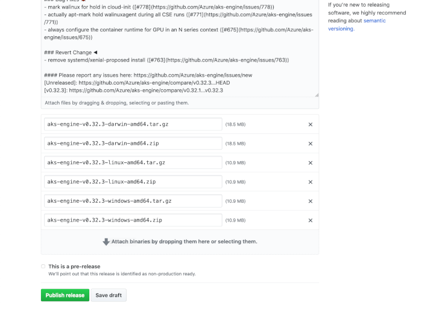

# Releases

aks-engine uses a [continuous delivery][] approach for creating releases. Every merged commit that passes
testing results in a deliverable that can be given a [semantic version][] tag and shipped.

## Master Is Always Releasable

The master `git` branch of a project should always work. Only changes considered ready to be
released publicly are merged.

aks-engine depends on components that release new versions as often as needed. Fixing
a high priority bug requires the project maintainer to create a new patch release.
Merging a backward-compatible feature implies a minor release.

By releasing often, each release becomes a safe and routine event. This makes it faster
and easier for users to obtain specific fixes. Continuous delivery also reduces the work
necessary to release a product such as aks-engine, which depends on several external projects.

"Components" applies not just to AKS projects, but also to development and release
tools, to orchestrator versions, to Docker base images, and to other Azure
projects that do [semantic version][] releases.

## AKS Engine Releases As Needed

AKS Engine releases new versions when the team of maintainers determine it is needed. This usually
amounts to one or more releases each month.

Minor versions—for example, v0.**32**.0—are created from the master branch whenever
important features or changes have been merged and CI testing shows it to be stable over time.

Patch versions—for example, v0.32.**3**—are based on the previous release and created on demand
whenever important bug fixes arrive.

See "[Creating a New Release](#creating-a-new-release)" for more detail.

## Semantic Versioning

aks-engine releases comply with [semantic versioning][semantic version], with the "public API" broadly
defined as:

- REST, gRPC, or other API that is network-accessible
- Library or framework API intended for public use
- "Pluggable" socket-level protocols users can redirect
- CLI commands and output formats
- Integration with Azure public APIs such as ARM

In general, changes to anything a user might reasonably link to, customize, or integrate with should
be backward-compatible, or else require a major release. aks-engine users can be confident that upgrading
to a patch or to a minor release will not break anything.

## Creating a New Release

Let's go through the process of creating a new release of [aks-engine][].

We will use **v0.32.3** as an example herein. You should replace this with the new version you're releasing.

```
$ export TAG=v0.32.3
```

### Prepare and Tag a Branch

First ensure that all the commits to be included in the release are ready in your local repository.

For a major or minor release, create a branch from master. For a patch, create a branch from the previous release tag and use `git cherry-pick` to apply specific commits.

Tag the release commit and push it to GitHub:

```
$ git tag $TAG && git push upstream $TAG
```

### Generate Release Notes

Use the [`git-chglog`][git-chglog] tool to generate release notes:

```
$ git-chglog $TAG
```

Be sure to proofread the output and verify that the intended commits appear. If a commit made it to master that didn't have a [conventional commit message][conventional-commit], you'll need to add it to the appropriate section by hand.

Save the markdown that it prints so it can be pasted into the GitHub release.

### Generate Download Artifacts

Make sure your repository has no local changes, then build the aks-engine distribution archives:

```
$ make info  # check that the git tree state is clean and the tag is correct
$ make clean dist
```

When this finishes, the `_dist` directory will be populated with three .zip and three .tar.gz archive files.

### Make a GitHub Release

Now navigate to the aks-engine project on GitHub and start a [new release][new-release]:


Select the tag we pushed previously, and use that tag as the release title. Then paste the release notes from the previous step into the big text field:


Finally, drag all six archive files we created with `make dist` into the "Attach binaries" field at the bottom of the release web form:



Proofread the release notes and satisfy yourself that everything is in order. Click the "Publish release" button when the new aks-engine release is ready for the world.

### Update Package Managers

Finally, let's make the new aks-engine release easy to install.

#### The `gofish` package manager

Create a pull request to add the new release to [gofish][] through the [fish-food repository][gofish-food]. You will need to calculate the sha256 checksum for each of the .tar.gz archives:

```
$ for tarball in darwin-amd64 linux-amd64 windows-amd64; do shasum -a 256 _dist/aks-engine-$TAG-$tarball.tar.gz; done
857f5780aa1d4fc2b3f6eb40b22fb2a076de3ae5fd927141dd1984d0924656d4  _dist/aks-engine-v0.32.3-darwin-amd64.tar.gz
19de96befe656c432fbde71c582fb3f9de8ab9abc681f1607852c4fc4a0bcb99  _dist/aks-engine-v0.32.3-linux-amd64.tar.gz
830f7baf8b2d04e97f313c079170b6e4715f7cd410310479581a6627a6e95f41  _dist/aks-engine-v0.32.3-windows-amd64.tar.gz
```

Paste each checksum in the appropriate section and update the release version. The PR will look very similar to [this recent update][gofish-pr].

#### The `brew` package manager

Create a pull request to add the new release to [brew][] through our [homebrew tap repository][brew-tap]. Use the macOS sha256 checksum from the `gofish` PR in the previous step. The PR will look very similar to [this recent update][brew-pr].

#### The `choco` package manager

Adding new versions to [choco][] is automated, but you can check the status of package approval and publishing at the [aks-engine chocolatey page][choco-status].

Note that it can take a while for the NuGet machinery to submit the current release, and it may be reviewed for several days before it is actually made available.

#### The official Docker image

(Coming soon).

[aks-engine]: https://github.com/Azure/aks-engine/releases
[brew]: https://brew.sh/
[brew-pr]: https://github.com/Azure/homebrew-aks-engine/pull/5
[brew-tap]: https://github.com/Azure/homebrew-aks-engine/
[choco]: https://chocolatey.org/
[choco-status]: https://chocolatey.org/packages/aks-engine/
[conventional-commit]: https://www.conventionalcommits.org/en/v1.0.0-beta.3/
[git-chglog]: https://github.com/git-chglog/git-chglog
[gofish]: https://github.com/fishworks/gofish
[gofish-food]: https://github.com/fishworks/fish-food/
[gofish-pr]: https://github.com/fishworks/fish-food/pull/141
[new-release]: https://github.com/Azure/aks-engine/releases/new
[continuous delivery]: https://en.wikipedia.org/wiki/Continuous_delivery
[semantic version]: http://semver.org
