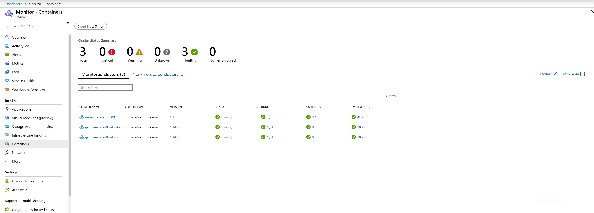
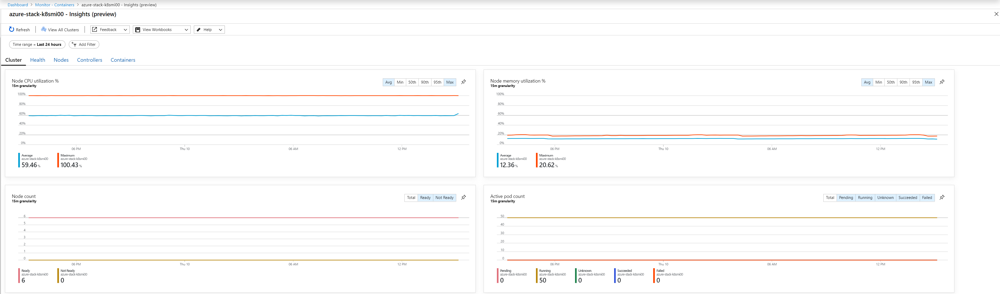
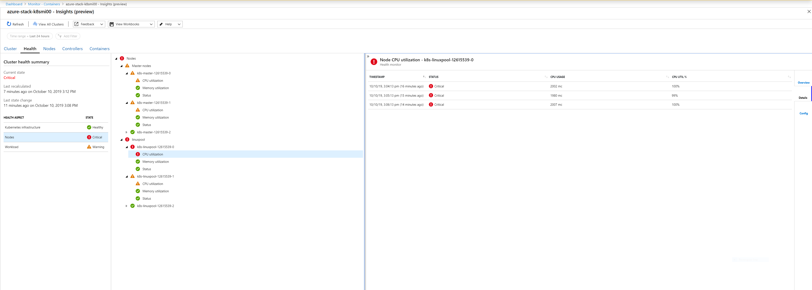
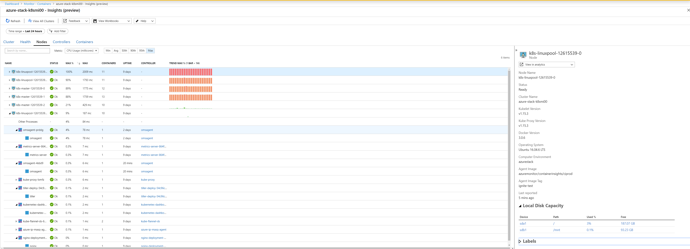
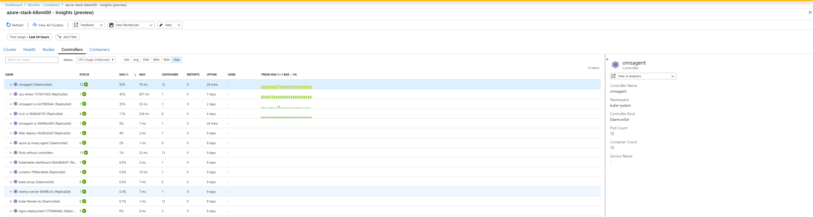
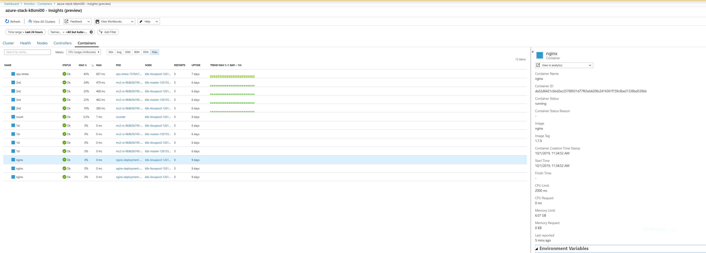

# AKS Engine on Azure Stack - Public Preview

* [Introduction](#introduction)
* [Marketplace Prerequisites](#marketplace-prerequisites)
* [Service Principals and Identity Providers](#service-principals-and-identity-providers)
* [CLI flags](#cli-flags)
* [Cluster Definition (aka API Model)](#cluster-definition-aka-api-model)
    * [location](#location)
    * [kubernetesConfig](#kubernetesConfig)
    * [customCloudProfile](#customCloudProfile)
    * [masterProfile](#masterProfile)
    * [agentPoolProfiles](#agentPoolProfiles)
* [Azure Stack Instances Registered with Azure's China cloud](#azure-stack-instances-registered-with-azures-china-cloud)
* [Disconnected Azure Stack Instances](#disconnected-azure-stack-instances)
* [Azure Monitor for containers](#azure-Monitor-for-containers)
* [Unsupported Addons](#unsupported-addons)
* [Known Issues and Limitations](#known-issues-and-limitations)
* [Frequently Asked Questions](#frequently-asked-questions)

## Introduction

Starting from [release](https://github.com/Azure/aks-engine/releases/) v0.36.2, AKS Engine can be used to provision self-managed Kubernetes clusters on [Azure Stack](https://azure.microsoft.com/overview/azure-stack/). It is now possible to execute AKS Engine's `generate`, [deploy](../tutorials/deploy.md), [upgrade](upgrade.md), and [scale](scale.md) commands as if you were targeting Azure's public cloud. You are only required to slightly update your cluster definition to provide some extra information about your Azure Stack instance.

The goal of this guide is to explain how to provision Kubernetes clusters to Azure Stack using AKS Engine and to capture the differences between Azure and Azure Stack. Bear in mind as well that not every AKS Engine feature or configuration option is currently supported on Azure Stack. In most cases, these are not available because dependent Azure components are not part of Azure Stack.

## Marketplace prerequisites

Because Azure Stack instances do not have infinite storage available, Azure Stack administrators are in charge of managing it by selecting which marketplace items are downloaded from Azure's marketplace. The Azure Stack administrator can follow this [guide](https://docs.microsoft.com/azure-stack/operator/azure-stack-download-azure-marketplace-item) for a general explanation about how to download marketplace items from Azure.

Before you try to deploy the first Kubernetes cluster, make sure these marketplace items were made available to the target subscription by the Azure Stack administrator.

- `Custom Script for Linux 2.0` virtual machine extension
- `Ubuntu Server 16.04 LTS` or `AKS Base Image` virtual machines

The `AKS Base Image` is the only viable option if you are deploying to a [disconnected instance](#disconnected-azure-stack-instances).

_Note: AKS Engine on disconnected Azure Stack instances is a preview feature_

## Service Principals and Identity Providers

Kubernetes uses a `service principal` identity to talk to Azure Stack APIs to dynamically manage resources such as storage or load balancers. Therefore, you will need to create a service principal before you can provision a Kubernetes cluster using AKS Engine.

This [guide](https://docs.microsoft.com/azure-stack/operator/azure-stack-create-service-principals) explains how to create and manage service principals on Azure Stack for both Azure Active Directory (AAD) and Active Directory Federation Services (ADFS) identity providers. This other [guide](../../docs/topics/service-principals.md) is a good resource to understand the permissions that the service principal requires to deploy under your subscription.

Once you have created the required service principal, make sure to assign it the `contributor` role at the target subscription scope.

## CLI flags

To indicate to AKS Engine that your target platform is Azure Stack, all commands require CLI flag `azure-env` to be set to `"AzureStackCloud"`.

If your Azure Stack instance uses ADFS to authenticate identities, then flag `identity-system` is also required.

``` bash
aks-engine deploy \
    --azure-env AzureStackCloud \
    --api-model kubernetes.json \
    --location local \
    --resource-group kube-rg \
    --identity-system adfs \ # Optional if azure_ad
    --client-id $SPN_CLIENT_ID \
    --client-secret $SPN_CLIENT_SECRET \
    --subscription-id $TENANT_SUBSCRIPTION_ID \
    --output-directory kube-rg
```

## Cluster Definition (aka API Model)

This section details how to tailor your cluster definitions in order to make them compatible with Azure Stack. You can start off from this [template](../../examples/azure-stack/kubernetes-azurestack-azure-ad.json) if your identity provider is AAD or from this other [template](../../examples/azure-stack/kubernetes-azurestack-adfs.json) if you are using ADFS instead.

Unless otherwise specified down below, standard [cluster definition](../../docs/topics/clusterdefinitions.md) properties should also work with Azure Stack. Please create an [issue](https://github.com/Azure/aks-engine/issues/new) if you find that we missed a property that should be called out.

### location

| Name       | Required | Description                                                   |
| ---------- | -------- | ------------------------------------------------------------- |
| location   | yes      | The region name of the target Azure Stack. |

### kubernetesConfig

`kubernetesConfig` describes Kubernetes specific configuration.

| Name                            | Required | Description                          |
| ------------------------------- | -------- | ------------------------------------ |
| addons                          | no       | A few addons are not supported on Azure Stack. See the [complete list](#unsupported-addons) down below.|
| kubernetesImageBase             | yes      | Specifies the default image base URL to be used for all Kubernetes-related containers such as hyperkube, cloud-controller-manager, pause, addon-manager, etc. This property should be set to `"mcr.microsoft.com/k8s/azurestack/core/"`. |
| networkPlugin                   | yes      | Specifies the network plugin implementation for the cluster. Valid values are `"kubenet"` for Kubernetes software networking implementation, and `"flannel"` to use CoreOS Flannel. |
| networkPolicy                   | no       | Network policies can be enforced using [Canal](https://docs.projectcalico.org/v3.7/getting-started/kubernetes/installation/flannel). |
| useInstanceMetadata             | no      | Use the Azure cloud provider instance metadata service for appropriate resource discovery operations. This property should be always set to `"false"`. |

### customCloudProfile

`customCloudProfile` contains information specific to the target Azure Stack instance.

| Name                            | Required | Description|
| ------------------------------- | -------- | ---------- |
| environment                     | no       | The custom cloud type. This property should be always set to `"AzureStackCloud"`. |
| identitySystem                  | yes      | Specifies the identity provider used by the Azure Stack instance. Valid values are `"azure_ad"` (default) and `"adfs"`. |
| portalUrl                       | yes      | The tenant portal URL. |
| dependenciesLocation            | no       | Specifies where to locate the dependencies required to during the provision/upgrade process. Valid values are `"public"` (default), `"china"`, `"german"` and `"usgovernment".` |

### masterProfile

`masterProfile` describes the settings for master configuration.

| Name                            | Required | Description|
| ------------------------------- | -------- | ---------- |
| vmsize                          | yes      | Specifies a valid [Azure Stack VM size](https://docs.microsoft.com/azure-stack/user/azure-stack-vm-sizes). |
| distro                          | yes      | Specifies the masters' Linux distribution. Currently supported values are: `"ubuntu"` and `"aks-ubuntu-16.04"`. The latter is a custom image based on ubuntu-16.04 that comes with pre-installed software necessary for Kubernetes deployments. `"aks-ubuntu-16.04"` should be selected if you target a disconnected Azure Stack instance. |

### agentPoolProfiles

`agentPoolProfiles` are used to create agents with different capabilities.

| Name                            | Required | Description|
| ------------------------------- | -------- | ---------- |
| vmsize                          | yes      | Describes a valid [Azure Stack VM size](https://docs.microsoft.com/azure-stack/user/azure-stack-vm-sizes). |
| distro                          | yes      | Specifies the masters' Linux distribution. Currently supported values are: `"ubuntu"` and `"aks-ubuntu-16.04"`. The latter is a custom image based on ubuntu-16.04 that comes with pre-installed software necessary for Kubernetes deployments. `"aks-ubuntu-16.04"` should be selected if you target a disconnected Azure Stack instance. |
| availabilityProfile             | yes      | Only `"AvailabilitySet"` is currently supported. |
| acceleratedNetworkingEnabled    | yes      | Use `Azure Accelerated Networking` feature for Linux agents. This property should be always set to `"false"`. |

## Azure Stack Instances Registered with Azure's China cloud

If your Azure Stack instance is located in China, then the `dependenciesLocation` property of your cluster definition should be set to `"china"`. This switch ensures that the provisioning process fetches software dependencies from reachable hosts within China's mainland.

## Disconnected Azure Stack Instances

_Note: AKS Engine on disconnected Azure Stack instances is a private preview feature_

By default, the AKS Engine provisioning process relies on an internet connection to download the software dependencies required to create or upgrade a cluster (Kubernetes images, etcd binaries, network plugins and so on).

If your Azure Stack instance is air-gapped or if network connectivity in your geographical location is not reliable, then the default approach will not work, take a long time or timeout due to transient networking issues.

With these challenges in mind, you can choose to set the `distro` property of your cluster definition to `"aks-ubuntu-16.04"`. This change will instruct AKS Engine to deploy VM nodes using a base OS image called `AKS Base Image`. This custom image, generally based on Ubuntu Server, already contains the required software dependencies in its file system. Hence, internet connectivity won’t be required during the provisioning process.

The `AKS Base Image` marketplace item has to be available in your Azure Stack's Marketplace before it could be used by AKS Engine. Your Azure Stack administrator can follow this [guide](https://docs.microsoft.com/azure-stack/operator/azure-stack-download-azure-marketplace-item) for a general explanation about how to download marketplace items from Azure.

Each AKS Engine release is validated and tied to a specific version of the AKS Base Image. Therefore, you need to take note of the base image version required by the AKS Engine release that you plan to use, and then download exactly that base image version. New builds of the `AKS Base Image` are frequently released to ensure that your disconnected cluster can be upgraded to the latest supported version of each component.

# Azure Monitor for containers

Container Monitoring addon gives you performance monitoring ability by collecting memory and processor metrics from controllers, nodes, and containers that are available in Kubernetes through the Metrics API.
After you enable Container Monitoring addon, these metrics are automatically collected for you through a containerized version of the Log Analytics agent for Linux and stored in your [Log Analytics] workspace in Azure Cloud.
The included pre-defined views display the residing container workloads and what affects the performance health of the Kubernetes cluster so that you can:

- Identify containers that are running on the node and their average processor and memory utilization. This knowledge can help you identify resource bottlenecks.
- Identify where the container resides in a controller or a pod. This knowledge can help you view the controller's or pod's overall performance.
- Review the resource utilization of workloads running on the host that are unrelated to the standard processes that support the pod.
- Understand the behavior of the cluster under average and heaviest loads. This knowledge can help you identify capacity needs and determine the maximum load that the cluster can sustain.
- Logs (stdout/stderr) of the Containers to troubleshoot the issues in containers
- Scraping metrics from Prometheus. Refer [configuring prometheus scraping settings](https://docs.microsoft.com/en-us/azure/azure-monitor/insights/container-insights-agent-config#overview-of-configurable-prometheus-scraping-settings)

Refer to [Azure Monitor for containers](https://docs.microsoft.com/en-us/azure/azure-monitor/insights/container-insights-overview) for more details.

### Onboarding

Container Monitoring can be onboarded either through the Helm chart or container monitoring addon.

#### 1. Using Azure Monitor for containers Helm chart

Refer to [Azure Monitor – Containers Helm chart](https://github.com/Helm/charts/tree/master/incubator/azuremonitor-containers) for onboarding instructions

#### 2. Using Container Monitoring addon in the API Model
> Note: option 2) are supported only through `aks-engine deploy` command.

1. Add below container-monitoring addon section to your API Model definition, updated the workspaceGuid and workspaceKey of the Azure Log Analytics workspace
   and use updated API Model definition for cluster deployment.

"kubernetesConfig": {
    "addons": [
					  {
						"name": "container-monitoring",
						"enabled": true,
						"config": {
						  "workspaceGuid": "<Azure Log Analytics Workspace Guid in Base-64 encoded>",
						  "workspaceKey": "<Azure Log Analytics Workspace Key in Base-64 encoded>"
						}
					  }
                ]
  }

 2.  [Add the 'AzureMonitor-Containers' Solution to your Log Analytics workspace.](http://aka.ms/coinhelmdoc)

## UX

After successful onboarding, navigating to [Azure Monitor for containers](https://aka.ms/azmon-containers) to view and monitor, and analyze health of your onboarded AKS Engine cluster, pods and containers etc.

### Azure Monitor for containers view to view health of all clusters in selected global azure subscriptions


### Cluster chart view of the cluster


### Cluster health view of the cluster


### Nodes view of the cluster


### Controllers view of the cluster


### Containers view of the cluster


## Supported Matrix

 Refer to [azuremonitor-containers-aks-engine](https://github.com/Microsoft/OMS-docker/blob/aks-engine/README.md) for the supported matrix, troubleshooting and supportability etc.

## Disable Monitoring

After you enable monitoring of your AKS Engine cluster, you can stop monitoring the cluster if you decide you no longer want to monitor it.

- If you have onboarded the monitoring using the HELM chart, then you can disable monitoring by uninstalling the chart. Refer Uninstalling the Chart section in [azuremonitor-containers](https://github.com/helm/charts/tree/master/incubator/azuremonitor-containers)

- If you have onboarded using the Container Monitoring addon, then you can remove monitoring addon with below steps

      1. ssh to AKS Engine cluster master node and copy omsagent-daemonset.yaml file under /etc/kubernetes/addons to the dev machine
      2. delete all the resources related to container monitoring addon with `kubectl delete -f omsagent-daemonset.yaml` command against your AKS Engine cluster
      3. delete the container monitoring addon manifest file omsagent-daemonset.yaml  under /etc/kubernetes/addons

## Upgrade Container Monitoring Addon

For upgrading the container monitoring addon, you can disable the monitoring addon as described in Disable Monitoring section and use the HELM chart to install and upgrade


## Contact

If you have any questions or feedback regarding the container monitoring addon, please reach us out through [this](mailto:askcoin@microsoft.com) email.

## References

- [Azure Monitor for containers](https://docs.microsoft.com/en-us/azure/azure-monitor/insights/container-insights-overview) for  more details on how to use the product.
- [Log Analytics](https://docs.microsoft.com/en-us/azure/azure-monitor/log-query/log-query-overview)
- [Azure Resource Manager](https://docs.microsoft.com/en-us/azure/azure-monitor/platform/template-workspace-configuration)
- [Azure portal](https://docs.microsoft.com/en-us/azure/azure-monitor/learn/quick-create-workspace)
- [Manage workspaces](https://docs.microsoft.com/en-us/azure/azure-monitor/platform/manage-access)
- [Link to Azure Monitor for containers](https://aka.ms/azmon-containers)


## Required Roles and Permissions

- User requires the reader role permission on the Azure Log Analytics workspace and AKS Engine cluster resource group to view and monitor, and analyze health of your onboarded AKS Engine cluster, pods and containers etc.
- For onboarding monitoring addon
     -  If the existing Azure Log Analytics workspace is used, then the Log Analytics Contributor role on existing Azure Log Analytics is required
     -  For the new Azure Log Analytics workspace, user requires the contributor role on the Subscription or the Resource group where the AKS Engine cluster resources will be deployed

## Contact

If you have any questions or feedback regarding the container monitoring addon, please reach us out through [this](mailto:askcoin@microsoft.com) email.

## Unsupported Addons

AKS Engine includes a number of optional [addons](../topics/clusterdefinitions.md#addons) that can be deployed as part of the cluster provisioning process.

The list below includes the addons currently unsupported on Azure Stack:

* AAD Pod Identity
* ACI Connector
* Blobfuse Flex Volume
* Cluster Autoscaler
* KeyVault Flex Volume
* NVIDIA Device Plugin
* Rescheduler
* SMB Flex Volume

## Known Issues and Limitations

This section lists all known issues you may find when you use the public preview version.

### Agent Nodes Internet Connectivity

Your agent nodes may lose internet connectivity after all Kubernetes services of type `LoadBalancer` are deleted. You are not expected to experience this problem if no services of type `LoadBalancer` are ever created.

To work around this issue, do not delete `LoadBalancer` services as part of your release pipeline or always keep a dummy service.

### Limited Number of Frontend Public IPs

The `Basic` load balancer SKU available on Azure Stack limits the number of frontend IPs to 5. That implies that each cluster's agents pool is limited to 5 public IPs.

If you need to expose more than 5 services, then the recommendation is to route traffic to those services using an Ingress controller.

## Frequently Asked Questions

### Supported Kubernetes Versions

These are the Kubernetes versions that you can deploy to Azure Stack using AKS Engine:

- 1.15.4
- 1.15.3
- 1.14.7
- 1.14.6
- 1.13.11
- 1.13.10

If the Azure Stack instance is air-gapped, then the syndicated [AKS Base Image](#disconnected-azure-stack-instances) will determine the Kubernetes version that you can deploy or the target upgrade version. The table below lists the pre-pulled versions on each AKS Base Image version.

_Note: AKS Engine on disconnected Azure Stack instances is a preview feature_

| AKS Engine                 | AKS Base Image     | Kubernetes versions | Notes |
|----------------------------|--------------------|---------------------|-------|
| v0.39.0   | [AKS Base Ubuntu 16.04-LTS Image Distro, July 2019 (2019.07.30)](https://github.com/Azure/aks-engine/blob/v0.39.0/releases/vhd-notes/aks-ubuntu-1604/aks-ubuntu-1604-201907_2019.07.30.txt) | 1.15.1 - 1.14.4 - 1.14.3 - 1.13.8 - 1.13.7 - 1.12.8 - 1.12.7 - 1.11.10 - 1.11.9 |  |
| v0.39.1   | [AKS Base Ubuntu 16.04-LTS Image Distro, August 2019 (2019.08.09)](https://github.com/Azure/aks-engine/blob/v0.39.1/releases/vhd-notes/aks-ubuntu-1604/aks-ubuntu-1604-201908_2019.08.09.txt) | 1.15.2 - 1.15.1 - 1.14.5 - 1.14.4 - 1.13.9 - 1.13.8 - 1.12.8 - 1.12.7 - 1.11.10 - 1.11.9 |  |
| v0.39.2   | [AKS Base Ubuntu 16.04-LTS Image Distro, August 2019 (2019.08.09)](https://github.com/Azure/aks-engine/blob/v0.39.1/releases/vhd-notes/aks-ubuntu-1604/aks-ubuntu-1604-201908_2019.08.09.txt) | 1.15.2 - 1.14.5 - 1.13.9 - 1.12.8 - 1.12.7 - 1.11.10 - 1.11.9 |  |
| v0.40.1   | [AKS Base Ubuntu 16.04-LTS Image Distro, August 2019 (2019.08.21)](https://github.com/Azure/aks-engine/blob/v0.40.0/releases/vhd-notes/aks-ubuntu-1604/aks-ubuntu-1604-201908_2019.08.21.txt) | 1.15.3 - 1.15.2 - 1.14.6 - 1.14.5 - 1.13.10 - 1.13.9 - 1.12.8 - 1.12.7 - 1.11.10 - 1.11.9 |  |
| v0.41.2   | [AKS Base Ubuntu 16.04-LTS Image Distro, September 2019 (2019.09.19)](https://github.com/Azure/aks-engine/blob/v0.41.2/releases/vhd-notes/aks-ubuntu-1604/aks-ubuntu-1604-201908_2019.09.19.txt) | 1.15.4 - 1.15.3 - 1.14.7 - 1.14.6 - 1.13.11 -  1.13.10 |  |

### Network Policies

To enforce network policies, you are required to manually deploy the [Canal](https://docs.projectcalico.org/v3.7/getting-started/kubernetes/installation/flannel) daemonset.

### Sample extensions are not working

Extensions in AKS Engine provide an easy way to include your own customization at provisioning time.

Because Azure and Azure Stack currently rely on a different version of the Compute Resource Provider API, you may find that some of sample [extensions](https://github.com/Azure/aks-engine/tree/master/extensions) fail to deploy correctly.

This can be resolved by making a small modification to the extension `template.json` file. Replacing all usages of template parameter `apiVersionDeployments` by the hard-code value `2017-12-01` (or whatever API version Azure Stack runs at the time you try to deploy) should be all you need.

Once you are done updating the extension template, host the extension directory in your own Github repository or storage account. Finally, at deployment time, make sure that your cluster definition points to the new [rootURL](https://github.com/Azure/aks-engine/blob/master/docs/topics/extensions.md#rooturl).

### Troubleshoting

This [how-to guide](/docs/howto/troubleshooting.md) has a good high-level explanation of how AKS Engine interacts with the Azure Resource Manager (ARM) and lists a few potential issues that can cause AKS Engine commands to fail. Checkout the scripts in this [repository](https://github.com/msazurestackworkloads/azurestack-gallery/tree/master/diagnosis) to simplify the logs collection task.
