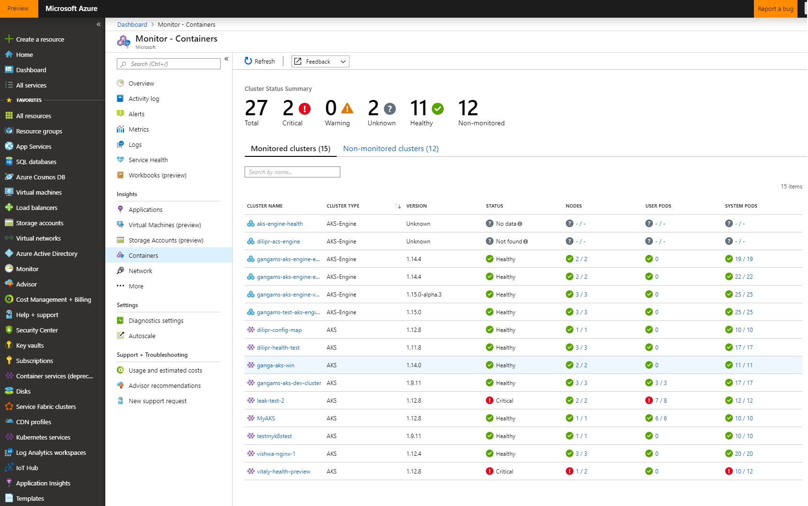

# Monitoring Kubernetes Clusters

Monitoring your Kubernetes cluster lets you see its health and performance. Statistics such as CPU, memory, and disk usage are available for both Linux and Windows nodes in your AKS Engine cluster.

Resource metrics are collected by the lightweight, in-memory [metrics-server][] component. Metrics-server discovers nodes and queries each one's kubelet for CPU and memory usage.

Metrics-server is part of every AKS Engine deployment. To verify that metrics-server is running in your cluster:

```shell
$ kubectl get pods --namespace=kube-system -l k8s-app=metrics-server
NAME                             READY   STATUS    RESTARTS   AGE
metrics-server-bb7db87bc-nm6vn   1/1     Running   2          140m
```

Tools like `kubectl` and the Kubernetes Dashboard use metrics-server, and it has an [API][metrics-server-api] to get metrics for your custom monitoring solution.

## Monitoring Options

1. [kubectl](#kubectl)
1. [Kubernetes Dashboard](#kubernetes-dashboard)
1. [Azure Monitor for containers](#azure-monitor-for-containers)
1. [Monitoring extension](#monitoring-extension)

## Kubectl

The `kubectl top` command is an easy way to see node or pod metrics in your terminal.

Use `kubectl top node` to see the resource consumption of nodes:

```shell
$ kubectl top node
NAME                                 CPU(cores)   CPU%   MEMORY(bytes)   MEMORY%
k8s-agentpool1-26399701-vmss000000   67m          3%     729Mi           10%
k8s-agentpool1-26399701-vmss000001   80m          4%     787Mi           10%
k8s-master-26399701-0                201m         10%    1406Mi          19%
```

Use `kubectl top pod` to see the resource consumption of pods:

```shell
$ kubectl top pod --namespace=kube-system
NAME                                            CPU(cores)   MEMORY(bytes)
azure-cni-networkmonitor-7gfd4                  2m           15Mi
...
kube-proxy-mzlq5                                1m           18Mi
kube-scheduler-k8s-master-26399701-0            3m           16Mi
metrics-server-bb7db87bc-nm6vn                  1m           12Mi
```

## Kubernetes Dashboard

The [Kubernetes Dashboard][kubernetes-dashboard] is a web-based user interface that can visualize cluster metrics.

The Dashboard addon is not enabled by default for an AKS Engine cluster. You must enable it before creating a cluster, as shown in this partial cluster configuration:

```json
"orchestratorProfile": {
  "orchestratorType": "Kubernetes",
  "kubernetesConfig": {
    "addons": [
      {
        "name": "kubernetes-dashboard",
        "enabled": true
      }
    ]
  }
```

To verify that the Kubernetes Dashboard is running in your cluster:

```shell
$ kubectl get pods --namespace=kubernetes-dashboard
NAME                                         READY   STATUS    RESTARTS   AGE
dashboard-metrics-scraper-7bdfbb4477-7mhc8   1/1     Running   0          18h
kubernetes-dashboard-b597987c-rr7bf          1/1     Running   0          18h
```

Accessing the Dashboard requires a Bearer Token. To create a token for demonstration purposes, you can follow the Kubernetes documentation on [creating-a-sample-user][].

> WARNING: The sample user created in the tutorial above will have administrative privileges and is for demonstration purposes only.

In a terminal window, create a command-line proxy to your cluster with this command:

```shell
kubectl proxy
```

This will make Dashboard available at http://localhost:8001/api/v1/namespaces/kubernetes-dashboard/services/https:kubernetes-dashboard:/proxy/.

Open that URL in a web browser on the same machine that's running `kubectl proxy`, and paste your token into the login screen when requested.

After authenticating, you can explore node metrics under the nodes section on the left menu. You can also see pod level metrics under the pods section, and even drill into a specific container in a given pod.


For more information about accessing the Dashboard, see the Kubernetes documentation on [web UI (dashboard)][web-ui-dashboard].

## Azure Monitor for containers

[Azure Monitor for containers][azure-monitor-for-containers] is a feature designed to monitor the performance of container workloads. It supports self-managed Kubernetes clusters using AKS Engine.

Azure Monitor for containers gives you performance visibility by collecting memory and processor metrics from controllers, nodes, and containers that are available in Kubernetes through the Metrics API. Container logs are also collected. Please see its documentation [overview][azure-monitor-for-containers] for more detail.

Azure Monitor for containers is known as the ["container-monitoring" addon][container-monitoring-addon] in AKS Engine, and it is not enabled by default. See the container-monitoring docs to learn how to enable and configure Azure Monitor for containers via addon.

Alternately, you can install the [azuremonitor-containers][] Helm chart to enable Azure Monitor for containers.

Once Azure Monitor for containers is enabled, navigate to https://aka.ms/azmon-containers to view the health, metrics, and logs of your AKS Engine clusters in the Azure portal website.

Refer to [azuremonitor-containers-aks-engine](https://github.com/Microsoft/OMS-docker/blob/aks-engine/README.md) for information about supported versions and for troubleshooting.



Please reach out with any questions or feedback by sending an email to [Azure Monitor for containers](mailto:askcoin@microsoft.com).

## Monitoring extension

A quick way to scaffold out cloud-native and open source monitoring components is to use the [aks-engine monitoring extension](https://github.com/Azure/aks-engine/tree/master/extensions/prometheus-grafana-k8s). For details on how to use the monitoring extension, please refer to the [extension documentation](https://github.com/Azure/aks-engine/tree/master/extensions/prometheus-grafana-k8s). By embedding the extension in your apimodel, the extension will do much of the work to create a monitoring solution in your cluster, which includes the following:

- [cAdvisor](https://github.com/google/cadvisor) daemon set to publish container metrics
- [Prometheus](https://prometheus.io/) for metrics collection and storage
- [Grafana](https://grafana.com/) for dashboard and visualizations

The extension wires up these components together. Post-deployment of the Kubernetes cluster, you just have to retrieve Grafana admin password (Kubernetes secret) and target your browser to the Grafana endpoint. There is already a pre-loaded Kubernetes cluster monitoring dashboard, so out-of-the-box you will have meaningful monitoring points with the extensibility that Prometheus and Grafana offer you.


[azure-monitor-for-containers]: https://docs.microsoft.com/en-us/azure/azure-monitor/insights/container-insights-overview
[azuremonitor-containers]: https://github.com/helm/charts/tree/master/incubator/azuremonitor-containers
[container-monitoring-addon]: ../../examples/addons/container-monitoring/README.md
[creating-a-sample-user]: https://github.com/kubernetes/dashboard/blob/master/docs/user/access-control/creating-sample-user.md
[kubernetes-dashboard]: https://kubernetes.io/docs/tasks/access-application-cluster/web-ui-dashboard/
[metrics-server]: https://github.com/kubernetes-sigs/metrics-server
[metrics-server-api]: https://github.com/kubernetes/metrics/blob/master/pkg/apis/metrics/v1beta1/types.go
[web-ui-dashboard]: https://kubernetes.io/docs/tasks/access-application-cluster/web-ui-dashboard/
