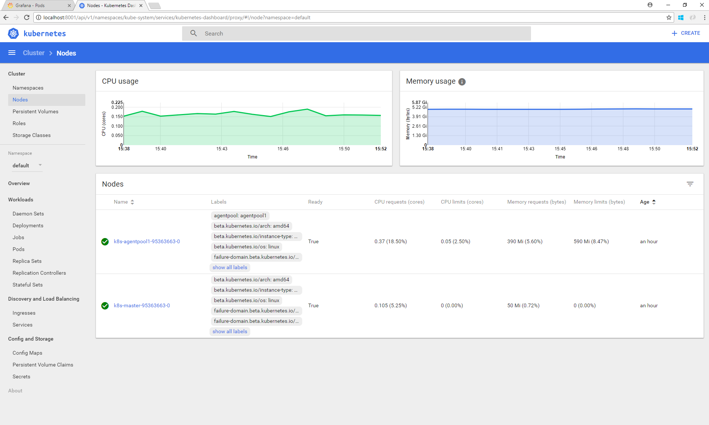
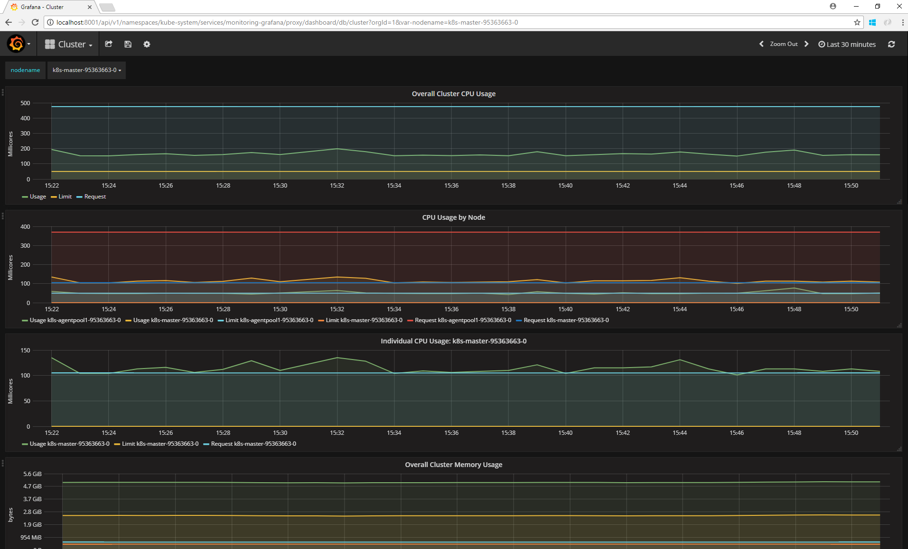
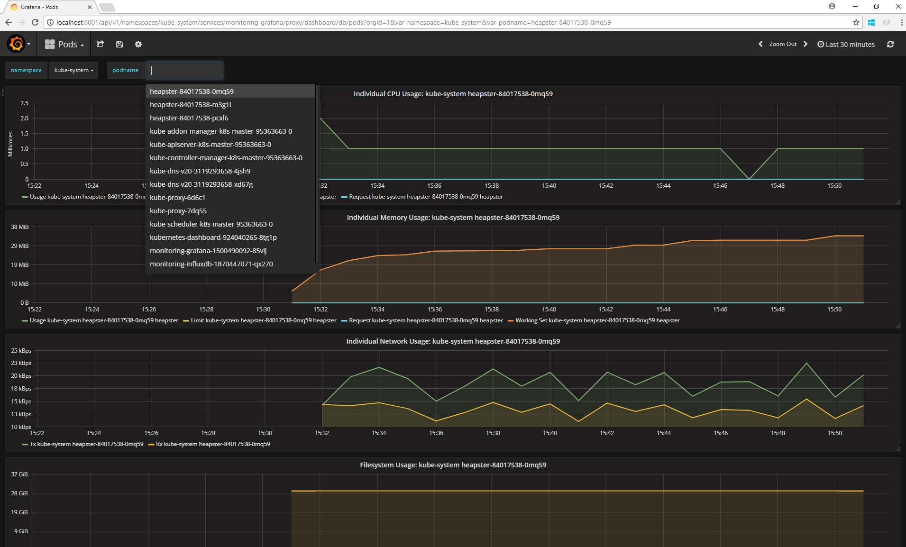

# Monitoring Kubernetes Clusters

Monitoring your Kubernetes cluster lets you see its health and performance. Statistics such as CPU, memory, and disk usage are available for both Linux and Windows nodes in your AKS Engine cluster.

Resource metrics are collected by the lightweight, in-memory [metrics-server][] component. Metrics-server discovers nodes and queries each one's kubelet for CPU and memory usage.

Metrics-server is part of every AKS Engine deployment. To verify that metrics-server is running in your cluster:

```shell
$ kubectl get pods --namespace=kube-system -l k8s-app=metrics-server
NAME                             READY   STATUS    RESTARTS   AGE
metrics-server-bb7db87bc-nm6vn   1/1     Running   2          140m
```

Tools like `kubectl` and the Kubernetes Dashboard use metrics-server, and it has an [API][metrics-server-api] to get metrics for your custom monitoring solution.

## Monitoring Options

1. [kubectl](#kubectl)
1. [Kubernetes Dashboard](#kubernetes-dashboard)
1. [Azure Monitor for containers](#azure-monitor-for-containers)
1. [Monitoring extension](#monitoring-extension)
1. [Grafana and Influx DB](#grafana-and-influx-db)

## Kubectl

The `kubectl top` command is an easy way to see node or pod metrics in your terminal.

Use `kubectl top node` to see the resource consumption of nodes:

```shell
$ kubectl top node
NAME                                 CPU(cores)   CPU%   MEMORY(bytes)   MEMORY%
k8s-agentpool1-26399701-vmss000000   67m          3%     729Mi           10%
k8s-agentpool1-26399701-vmss000001   80m          4%     787Mi           10%
k8s-master-26399701-0                201m         10%    1406Mi          19%
```

Use `kubectl top pod` to see the resource consumption of pods:

```shell
$ kubectl top pod --namespace=kube-system
NAME                                            CPU(cores)   MEMORY(bytes)
azure-cni-networkmonitor-7gfd4                  2m           15Mi
...
kube-proxy-mzlq5                                1m           18Mi
kube-scheduler-k8s-master-26399701-0            3m           16Mi
metrics-server-bb7db87bc-nm6vn                  1m           12Mi
```

## Kubernetes Dashboard

The [Kubernetes Dashboard][kubernetes-dashboard] is a web-based user interface that can visualize your cluster metrics. The Dashboard displays metrics that are known to the metrics-server component. The Kubernetes Dashboard addon is not enabled by default on your cluster. To access the Dashboard:

1. On Linux, run `kubectl proxy`. This will allow you to access the Kubernetes Dashboard at `http://localhost:8001/api/v1/namespaces/kubernetes-dashboard/services/https:kubernetes-dashboard:/proxy/`
    * If you are using Windows and sshing into the master to use kubectl, you will need to set up remote port forwarding from port 8001 on the master to your host in order to use `kubectl proxy`. To do this, under PUTTY > Connection > SSH > Tunnels, create a new forwarded port (source local port 8001 to destination 127.0.0.1:8001).

Once you have opened the UI, you can explore node stats (CPU, Memory, etc...) under the nodes section on the left menu. You can also see pod level metrics under the pods section, and even drill into a specific container in a given pod.



## Azure Monitor for containers

Azure Monitor for containers is a feature designed to monitor the performance of container workloads deployed to AKS Engine (formerly known as ACS-Engine) cluster(s) hosted on Azure. Monitoring your containers is critical, especially when you're running a production cluster, at scale, with multiple applications.

Azure Monitor for containers gives you performance visibility by collecting memory and processor metrics from controllers, nodes, and containers that are available in Kubernetes through the Metrics API. Container logs are also collected. After you enable monitoring from Kubernetes clusters, these metrics and logs are automatically collected for you through a containerized version of the Log Analytics agent for Linux and stored in your Log Analytics workspace.

Azure Monitor for containers for AKS Engine cluster(s) can be configured through following options

1. Helm chart [azuremonitor-containers](https://github.com/helm/charts/tree/master/incubator/azuremonitor-containers)
2. [Container-monitoring add-on](../../examples/addons/container-monitoring/README.md)

Navigate to [azmon-containers](https://aka.ms/azmon-containers) to view the health, metrics and logs of AKS-engine cluster(s).

For more details on how to use the product, see [Azure Monitor for containers](https://docs.microsoft.com/en-us/azure/azure-monitor/insights/container-insights-overview)

Refer to [azuremonitor-containers-aks-engine](https://github.com/Microsoft/OMS-docker/blob/aks-engine/README.md) for the supported matrix, troubleshooting and supportability etc.


If you have any questions or feedback regarding the monitoring of your AKS Engine (or ACS-Engine) cluster(s), please reach us out through [this](mailto:askcoin@microsoft.com) email.

## Monitoring extension

A quick way to scaffold out cloud-native and open source monitoring components is to use the [aks-engine monitoring extension](https://github.com/Azure/aks-engine/tree/master/extensions/prometheus-grafana-k8s). For details on how to use the monitoring extension, please refer to the [extension documentation](https://github.com/Azure/aks-engine/tree/master/extensions/prometheus-grafana-k8s). By embedding the extension in your apimodel, the extension will do much of the work to create a monitoring solution in your cluster, which includes the following:

- [cAdvisor](https://github.com/google/cadvisor) daemon set to publish container metrics
- [Prometheus](https://prometheus.io/) for metrics collection and storage
- [Grafana](https://grafana.com/) for dashboard and visualizations

The extension wires up these components together. Post-deployment of the Kubernetes cluster, you just have to retrieve Grafana admin password (Kubernetes secret) and target your browser to the Grafana endpoint. There is already a pre-loaded Kubernetes cluster monitoring dashboard, so out-of-the-box you will have meaningful monitoring points with the extensibility that Prometheus and Grafana offer you.

## Grafana and Influx DB

Another option to see stats is via Grafana and Influx DB. Grafana is a powerful dashboarding tool that can be used to visualize all types of data from various sources. InfluxDB is a database that is used to store time series data. Heapster is responsible for aggregating metrics across your cluster and ingesting them into InfluxDB. Then Grafana uses InfluxDB as it's datasource to visualize metrics.



To set up Grafana, we will need to deploy Grafana and InfluxDB. We will also need to configure Heapster to use InfluxDB as its storage backend.

1. `wget https://raw.githubusercontent.com/kubernetes/heapster/release-1.5/deploy/kube-config/influxdb/influxdb.yaml`
1. `wget https://raw.githubusercontent.com/kubernetes/heapster/release-1.5/deploy/kube-config/influxdb/grafana.yaml`
1. `kubectl create -f influxdb.yaml`
1. `kubectl create -f grafana.yaml`
1. `kubectl get pods --namespace=kube-system` Ensure that Heapster, Grafana and InfluxDB are in the `Running` state
1. `kubectl edit deployment/heapster --namespace=kube-system`

    We need to configure Heapster to use InfluxDB as the the data store. To do that under the spec > containers > command property change the command field from:
   ``` yaml
   - command:
     - /heapster
     - --source=kubernetes.summary_api:""
   ```
   to this:
   ```yaml
   - command:
     - /heapster
     - --source=kubernetes.summary_api:""
     - --sink=influxdb:http://monitoring-influxdb.kube-system.svc:8086
   ```
1. Save and exit from your editor to change the deployment. Now, Heapster will restart the pods and be configured to use InfluxDB. To ensure everything is ok, check the Heapster logs:
1. `getHeapster() { kubectl get pods -o go-template --template '{{range .items}}{{.metadata.name}}{{"\n"}}{{end}}' --namespace=kube-system | grep -i heapster; }`
1. `kubectl logs $(getHeapster) --namespace=kube-system -c heapster` Look at the logs of heapster to ensure it started up correctly.
You should see something like this if everything is ok:
```shell
azureuser@k8s-master-95363663-0:~/Heapster$ kubectl logs $(getHeapster) --namespace=kube-system -c heapster
I0830 22:30:57.671954       1 Heapster.go:72] /heapster --source=kubernetes:https://kubernetes.default --sink=influxdb:http://monitoring-influxdb.kube-system.svc:8086
I0830 22:30:57.671989       1 Heapster.go:73] Heapster version v1.3.0
I0830 22:30:57.672149       1 configs.go:61] Using Kubernetes client with master "https://kubernetes.default" and version v1
I0830 22:30:57.672166       1 configs.go:62] Using kubelet port 10255
I0830 22:30:57.747473       1 influxdb.go:252] created influxdb sink with options: host:monitoring-influxdb.kube-system.svc:8086 user:root db:k8s
I0830 22:30:57.747548       1 Heapster.go:196] Starting with InfluxDB Sink
I0830 22:30:57.747573       1 Heapster.go:196] Starting with Metric Sink
I0830 22:30:57.759987       1 Heapster.go:106] Starting heapster on port 8082
I0830 22:31:05.106039       1 influxdb.go:215] Created database "k8s" on influxDB server at "monitoring-influxdb.kube-system.svc:8086"
```

If everything looks ok and Grafana and Influx DB were able to start up, you can now access them! To do that:
1. Run `kubectl proxy`.
    * If you are using Windows and sshing into the master to use kubectl, you will need to set up remote port forwarding from port 8001 on the master to your host in order to use `kubectl proxy`. To do this, under Putty > Connection > SSH > Tunnels, create a new forwarded port (source local port 8001 to destination 127.0.0.1:8001).

1. To see cluster stats: `http://localhost:8001/api/v1/namespaces/kube-system/services/monitoring-grafana/proxy/dashboard/db/cluster`
1. To see pod stats: `http://localhost:8001/api/v1/namespaces/kube-system/services/monitoring-grafana/proxy/dashboard/db/pods`



[kubernetes-dashboard]: https://kubernetes.io/docs/tasks/access-application-cluster/web-ui-dashboard/
[metrics-server]: https://github.com/kubernetes-sigs/metrics-server
[metrics-server-api]: https://github.com/kubernetes/metrics/blob/master/pkg/apis/metrics/v1beta1/types.go
