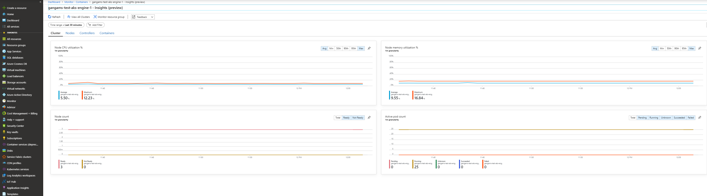
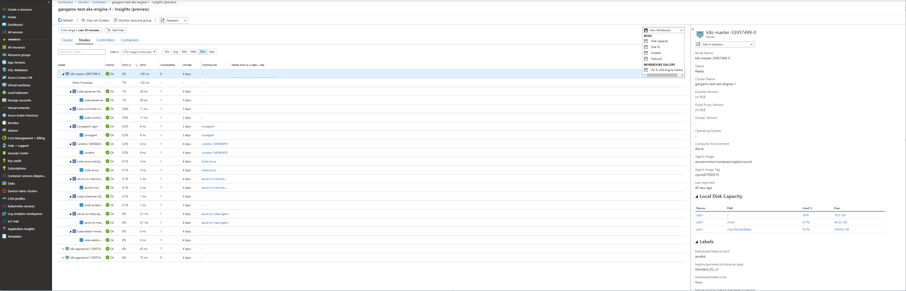
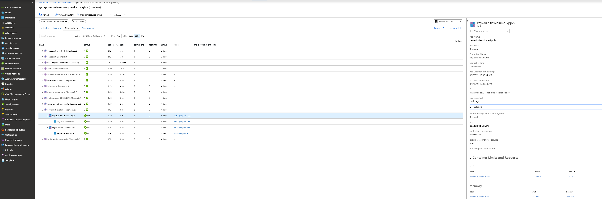
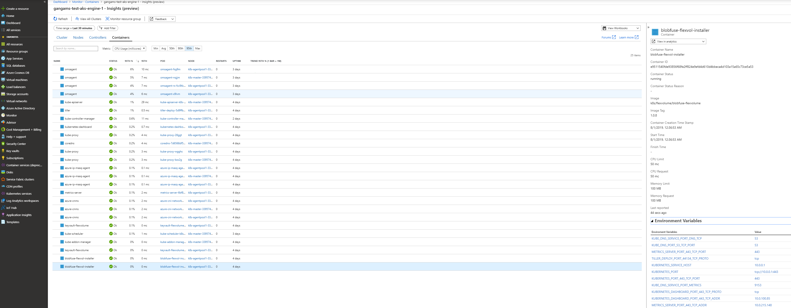

# Container-monitoring addon

This is sample API definition with Container-monitoring addon.

```json
{
  "apiVersion": "vlabs",
  "properties": {
    "orchestratorProfile": {
      "orchestratorType": "Kubernetes",
      "kubernetesConfig": {
        "addons": [
          {
            "name": "container-monitoring",
            "enabled": true
          }
        ]
      }
    },
    "masterProfile": {
      "count": 1,
      "dnsPrefix": "",
      "vmSize": "Standard_DS2_v2"
    },
    "agentPoolProfiles": [
      {
        "name": "agentpool",
        "count": 3,
        "vmSize": "Standard_DS2_v2",
        "availabilityProfile": "VirtualMachineScaleSets"
      }
    ],
    "linuxProfile": {
      "adminUsername": "azureuser",
      "ssh": {
        "publicKeys": [
          {
            "keyData": ""
          }
        ]
      }
    },
    "servicePrincipalProfile": {
      "clientId": "",
      "secret": ""
    }
  }
}

```
> Note: If the AKS Engine version is v0.38.5 or higher, the clusterName will be the dnsPrefix of the cluster. If the AKS Engine version is v0.29.1 or ACS Engine Kubernetes cluster, then default clusterName is my_acs_cluster_name in the container monitoring addon. In  AKS Engine version is less than v0.38.5, the default cluster name is aks-engine-cluster.

Example command to create AKS Engine cluster with monitoring addon
`aks-engine deploy --subscription-id <subscriptionId> --client-id <clientId> --client-secret <clientSecret> --dns-prefix <dnsPrefix> --location <location> --api-model  <kubernetes.json>`

You can validate that the addon is running as expected with the following commands:

You should see two sets of omsagent pods 1). One omsagent replicat set in one of the node 2). Many omsagent demonset pods as there are agent nodes .
All these pods should be in 'Running' state after executing:

```bash
kubectl get pods -n kube-system
```

## UX

Once the container monitoring addon added successfully, navigate to [azmon-containers](https://aka.ms/azmon-containers) to view the health, metrics and logs of your Kubernetes cluster(s).

### Azure Monitor for containers view to view health of all AKS and AKS Engine clusters in selected global azure subscriptions


### Cluster view of AKS Engine cluster


### Nodes view of AKS Engine cluster


### Controllers view of AKS Engine cluster


### Containers view of AKS Engine cluster


## Supported Matrix

 Refer to [azuremonitor-containers-aks-engine](https://github.com/Microsoft/OMS-docker/blob/aks-engine/README.md) for the supported matrix, troubleshooting and supportability etc.

## Disable Monitoring

After you enable monitoring of your AKS Engine cluster, you can stop monitoring the cluster if you decide you no longer want to monitor it.

- If you have onboarded the monitoring using the HELM chart, then you can disable monitoring by uninstalling the chart. Refer Uninstalling the Chart section in [azuremonitor-containers](https://github.com/helm/charts/tree/master/incubator/azuremonitor-containers)

- If you have onboarded using the Container Monitoring addon, then you can remove monitoring addon with below steps

      1. ssh to AKS Engine cluster master node and copy omsagent-daemonset.yaml file under /etc/kubernetes/addons to the dev machine
      2. delete the container monitoring addon manifest file omsagent-daemonset.yaml  under /etc/kubernetes/addons
      3. delete all the resources related to container monitoring addon with `kubectl delete -f omsagent-daemonset.yaml` command against your AKS Engine cluster

## Upgrade Container Monitoring Addon

For upgrading the container monitoring addon, you can disable the monitoring addon as described in Disable Monitoring section and use the HELM chart to install and upgrade


## Contact

If you have any questions or feedback regarding the container monitoring addon, please reach us out through [this](mailto:askcoin@microsoft.com) email.

## References

- [Azure Monitor for containers](https://docs.microsoft.com/en-us/azure/azure-monitor/insights/container-insights-overview) for  more details on how to use the product.
- [Log Analytics](https://docs.microsoft.com/en-us/azure/azure-monitor/log-query/log-query-overview)
- [Azure Resource Manager](https://docs.microsoft.com/en-us/azure/azure-monitor/platform/template-workspace-configuration)
- [Azure portal](https://docs.microsoft.com/en-us/azure/azure-monitor/learn/quick-create-workspace)
- [Manage workspaces](https://docs.microsoft.com/en-us/azure/azure-monitor/platform/manage-access)
- [Link to Azure Monitor for containers](https://aka.ms/azmon-containers)
