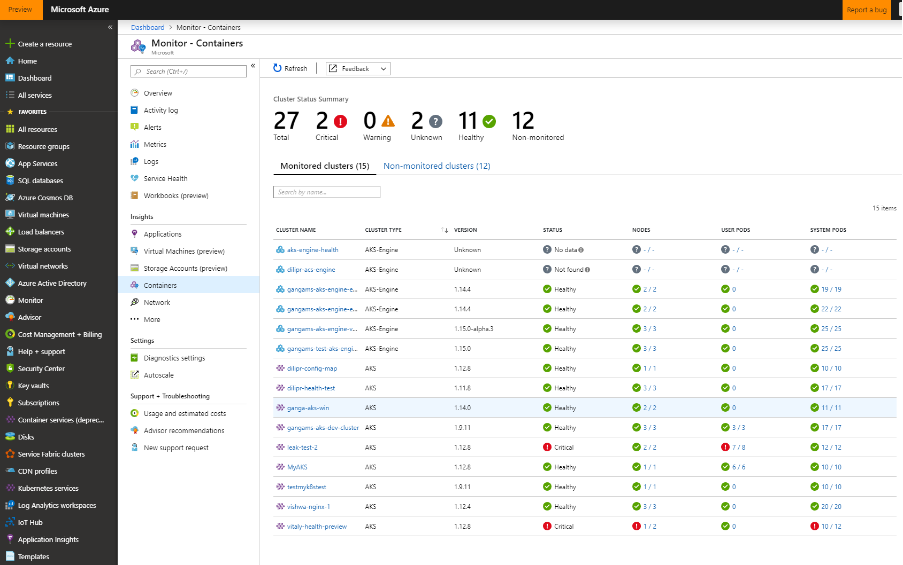

# Container-monitoring addon

> Note: If more than one AKS Engine cluster planned to configure to the same Azure Log Analytics Workspace then preferred option to use Helm chart to onboard the container monitoring addon. Refer [azuremonitor-containers](https://github.com/helm/charts/tree/master/incubator/azuremonitor-containers) to onboard using HELM chart.

This is the Container-monitoring addon. This addon requires Azure Log Analytics Workspace GUID and key in Base64 encoded form. If you don't have Azure Log Analytics workspace, please create one by following the instructions in https://docs.microsoft.com/en-us/azure/log-analytics/log-analytics-quick-create-workspace.
> Note: Workspace GUID and Key MUST be in Base-64 encoded.

Here are the instructions to obtain the Workspace Guid and Key of your Azure Log Analytics workspace

- In the Azure portal, click All services. In the list of resources, type Log Analytics. As you begin typing, the list filters based on your input. Select Log Analytics Workspaces.
- In your list of Log Analytics workspaces, select the workspace you intend on configuring the agent to report to.
- Select Advanced settings.
- Select Connected Sources, and then select Linux Servers.
- Copy and paste into your favorite editor, the Workspace ID and Primary Key.

Update the json file with your Base-64 encoded Workspace Guid and Key along with other parameter values, and use this update json file to automatically enable container monitoring in your new Kubernetes cluster.

Following additional steps required to view the health, metrics and logs of your AKS Engine cluster(s)

1. [Add the 'AzureMonitor-Containers' Solution to your Log Analytics workspace.](http://aka.ms/coinhelmdoc)

2. [For AKS-engine K8S cluster, add clusterName and Log Analytics workspace tag to cluster resources, to be able to use Azure Container monitoring User experience (aka.ms/azmon-containers)](http://aka.ms/coin-acs-tag-doc)

> Note: At the moment, if the AKS Engine version is v0.29.1 or ACS-Engine Kubernetes cluster, then default clusterName is my_acs_cluster_name in the container monitoring addon. In  AKS Engine version greater than v0.29.1, the default cluster name is aks-engine-cluster. This name needs to be tagged as clusterName value in step #2 above.

Navigate to [azmon-containers](https://aka.ms/azmon-containers) to view the health, metrics and logs of your Kubernetes cluster(s).

If you have any questions regarding the Container Monitoring addon, please reach us out through [this](mailto:askcoin@microsoft.com) email.

```json
{
  "apiVersion": "vlabs",
  "properties": {
    "orchestratorProfile": {
      "orchestratorType": "Kubernetes",
      "kubernetesConfig": {
        "addons": [
          {
            "name": "container-monitoring",
            "enabled": true,
            "config": {
              "workspaceGuid": "<Azure Log Analytics Workspace Guid in Base-64 encoded>",
              "workspaceKey": "<Azure Log Analytics Workspace Key in Base-64 encoded>"
            }
          }
        ]
      }
    },
    "masterProfile": {
      "count": 1,
      "dnsPrefix": "",
      "vmSize": "Standard_DS2_v2"
    },
    "agentPoolProfiles": [
      {
        "name": "agentpool",
        "count": 3,
        "vmSize": "Standard_DS2_v2",
        "availabilityProfile": "VirtualMachineScaleSets"
      }
    ],
    "linuxProfile": {
      "adminUsername": "azureuser",
      "ssh": {
        "publicKeys": [
          {
            "keyData": ""
          }
        ]
      }
    },
    "servicePrincipalProfile": {
      "clientId": "",
      "secret": ""
    }
  }
}

```

You can validate that the addon is running as expected with the following commands:

You should see two sets of omsagent pods 1). One omsagent replicat set in one of the node 2). Many omsagent demonset pods as there are agent nodes .
All these pods should be in 'Running' state after executing:

```bash
kubectl get pods -n kube-system
```

## UX

For more details on how to use the product, see [Azure Monitor for containers](https://docs.microsoft.com/en-us/azure/azure-monitor/insights/container-insights-overview)



## Supported Matrix

 Refer to [azuremonitor-containers-aks-engine](https://github.com/Microsoft/OMS-docker/blob/aks-engine/README.md) for the supported matrix, troubleshooting and supportability etc.

## Disable Monitoring

After you enable monitoring of your AKS Engine cluster, you can stop monitoring the cluster if you decide you no longer want to monitor it.

- If you have onboarded the monitoring using the HELM chart, then you can disable monitoring by uninstalling the chart. Refer Uninstalling the Chart section in [azuremonitor-containers](https://github.com/helm/charts/tree/master/incubator/azuremonitor-containers)

- If you have onboarded using the Container Monitoring addon, then you can stop monitoring either

      - kubectl delete -f <kubernetesmasteraddons-omsagent-daemonset.yaml>

        or

      - deleting omsagent daemonset and replicaset using Kubectl tool

## Contact

If you have any questions or feedback regarding the container monitoring addon, please reach us out through [this](mailto:askcoin@microsoft.com) email.

## References

- [Log Analytics](https://docs.microsoft.com/en-us/azure/azure-monitor/log-query/log-query-overview)
- [Azure Resource Manager](https://docs.microsoft.com/en-us/azure/azure-monitor/platform/template-workspace-configuration)
- [Azure portal](https://docs.microsoft.com/en-us/azure/azure-monitor/learn/quick-create-workspace)
- [Manage workspaces](https://docs.microsoft.com/en-us/azure/azure-monitor/platform/manage-access)
- [Link to Container Health](https://aka.ms/ci-dogfood)
- [Add Container Insights](https://github.com/Microsoft/OMS-docker/blob/ci_feature_prod/docs/solution-onboarding.md)
- [script for attaching the monitoring tags](https://github.com/Microsoft/OMS-docker/blob/ci_feature/docs/attach-monitoring-tags.md)
